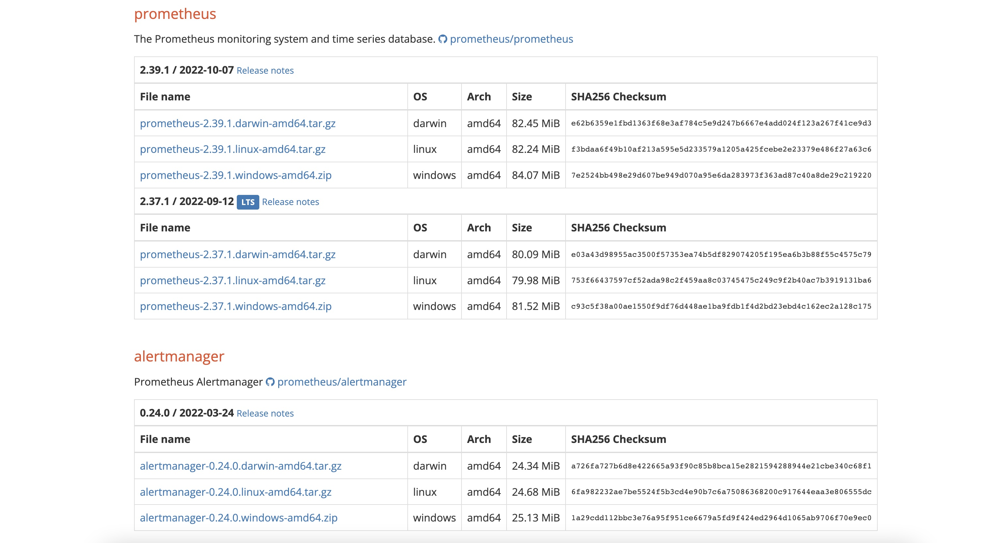

# prometheus

## prometheus安装配置

服务器环境: centOS7.6

### 从官网下载prometheus安装包

> prometheus官网地址:(https://prometheus.io/download/)

下载Prometheus以及alertmanager安装包



```shell
tar zxf prometheus-x.xx.x.linux-amd64.tar.gz -C /usr/local
mv /opt/prometheus-x.xx.x.linux-amd64 /usr/local/prometheus
```

### 配置开机自启

```shell
vim /usr/lib/systemd/system/prometheus.service
```

```
[Unit]
Description=prometheus service
 
[Service]
User=root
ExecStart=/opt/prometheus/prometheus --config.file=/opt/prometheus/prometheus.yml --storage.tsdb.path=/opt/prometheus/data
 
TimeoutStopSec=10
Restart=on-failure
RestartSec=5
 
[Install]
WantedBy=multi-user.target

### 启动服务
systemctl daemon-reload
systemctl enable prometheus
systemctl start prometheus
systemctl status prometheus
```

